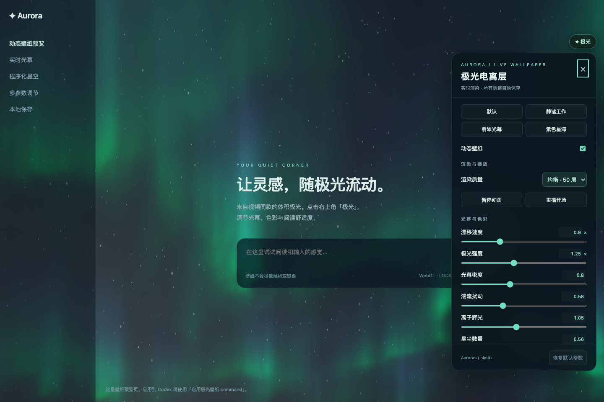
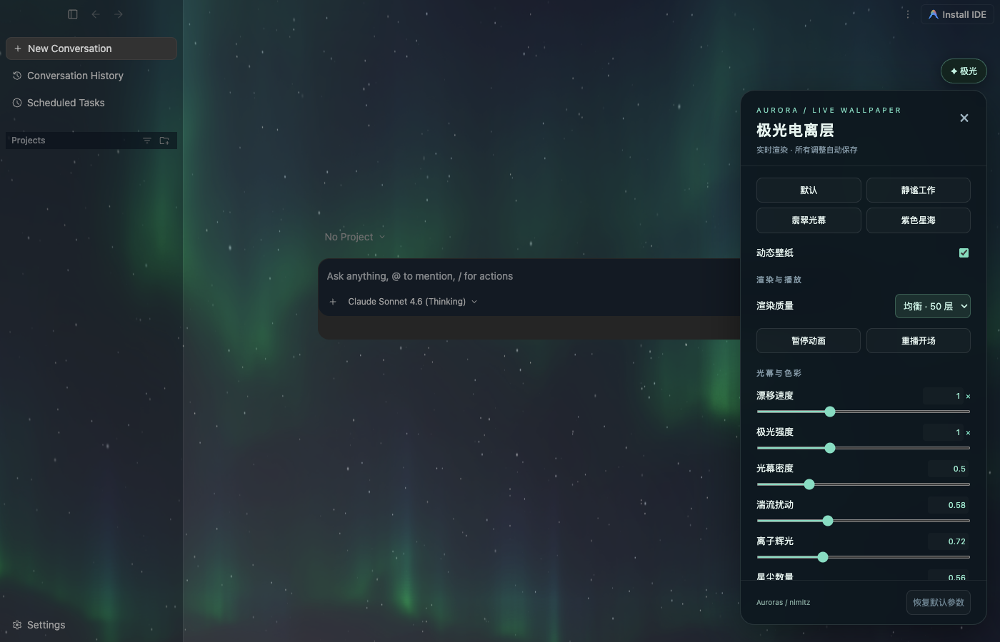
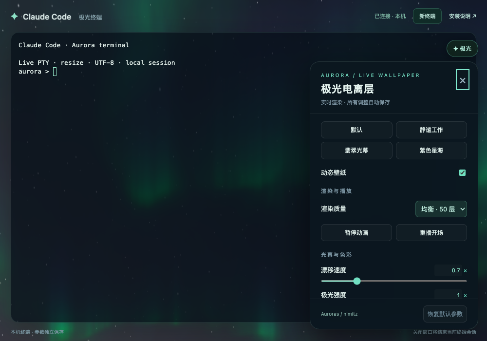

# Code Aurora Wallpaper · 极光动态壁纸

为 **Codex、Cursor、Antigravity 和 Claude Code 终端**提供同一套实时极光与中文控制面板。17 个数值参数、三档画质、四种预设，支持自动保存、暂停、参数导入导出和独立恢复。



上图为独立预览页。非官方定制项目，与 OpenAI、Anysphere、Google 或 Anthropic 无关联。

## 下载和使用

从 [Releases](https://github.com/liam13472409598-sudo/codex-aurora-wallpaper/releases/latest) 下载 `Code-Aurora-Wallpaper-macOS.zip` 并解压，保留完整目录。

| 使用位置 | 启动 | 恢复或关闭 |
| --- | --- | --- |
| Codex 桌面应用 | `启用极光壁纸.command` | `恢复原界面.command` |
| Cursor 桌面应用 | `启用Cursor极光.command` | `恢复Cursor界面.command` |
| Antigravity 2.x 桌面应用 | `启用Antigravity极光.command` | `恢复Antigravity界面.command` |
| Claude Code 命令行 | `启用ClaudeCode极光终端.command` | `关闭ClaudeCode极光终端.command` |
| 独立预览 | `预览壁纸.command` | 关闭浏览器标签页 |

双击对应 `.command` 文件即可。若 macOS 未直接执行，可在终端进入解压目录运行 `zsh ./启用Cursor极光.command` 等对应命令。

Codex / Cursor / Antigravity 首次启用需要正常重开应用，启动器会提示。请先等待当前任务完成并保存输入。启动后通过右上角 **✦ 极光** 调节。以后通过对应启动器打开，才会自动加载壁纸。

**从 v1.0 升级：先用旧目录里的恢复脚本停用旧版，再解压新版启用。**

## Antigravity 的接入方式

适配 Antigravity 2.x 独立桌面应用（本机验证版本 2.18.1），不是旧版 Antigravity IDE 或浏览器网页。保留原有输入和工作区布局，在背景加入极光，右上角提供同样的 17 个参数与预设。建议使用深色主题。

Antigravity 每次启动会更换本地网页地址，因此参数另存于 `.runtime/antigravity/settings.json`，守护程序约每 2.5 秒同步一次；调整后请稍等再退出。已验证恢复原界面、重新启动与跨地址参数保留。



## Claude Code 的接入方式

Claude Code 版使用一个独立的本机终端窗口，带真实 PTY、终端快捷键、中文输入和自动尺寸适配。Google Chrome 已安装时以独立应用窗口打开，否则使用默认浏览器。

- 已安装 `claude`：自动运行 Claude Code，并使用它现有的登录与配置。
- 未安装 `claude`：打开普通登录 shell，并显示安装提示；按 [官方说明](https://code.claude.com/docs/en/overview) 安装和登录后，输入 `claude` 即可。
- 点击「新终端」或关闭窗口会结束当前终端会话；可在支持的情况下使用 Claude Code 的会话恢复功能。
- 默认工作目录是解压目录，可在终端中 `cd` 到项目后执行 `claude`。也可以运行 `node terminal/server.mjs start --cwd /path/to/project`。



上图是终端连通性演示，不是已登录 Claude Code 的截图。本机测试环境未安装 `claude` 命令，所以验收范围为终端与壁纸，未执行实际 Claude Code 对话。

**不向 Claude 桌面应用注入。** 本机 Claude Desktop 1.46388.4 明确拒绝携带调试开关启动，无法沿用 Codex / Cursor 的接入方式；本项目不修改该应用或绕过它的限制。需要的是桌面 Code 页面背景时，这一版本不支持。

## 参数

| 类别 | 可调内容 |
| --- | --- |
| 光幕 | 漂移速度、强度、密度、湍流、辉光 |
| 色彩与星空 | 色相、饱和度、星尘数量 |
| 阅读 | 壁纸透明度、阅读遮罩、面板不透明度 |
| 开场 | 时长、羽化、光幕起点与终点、天空显现、星尘延迟 |
| 渲染 | 轻量 32 层 / 均衡 50 层 / 精细 72 层 |

预设：**默认、静谧工作、翡翠光幕、紫色星海**。滑块旁数字可直接编辑。各应用分别保存设置，也能通过 JSON 导入导出共享预设。

最高约 30 FPS，文档隐藏时暂停；支持自适应分辨率、暂停／继续、重播开场和显卡上下文恢复。Cursor 建议使用深色主题以保持编辑器语法颜色易读。

## 依赖与运行方式

- macOS。Codex / Cursor / Antigravity 安装在 `/Applications`。
- 启动器优先查找 Codex 自带的 Node.js，再查找当前用户的 Codex 工作区运行时和 PATH 中的 Node.js 22+。未安装 Codex 的用户可单独安装 Node.js。
- Claude Code 极光终端还需要 Python 3。发行 ZIP 已包含 xterm.js、FitAddon、ws，无需 npm 安装运行依赖。
- Codex 使用 `127.0.0.1:9347`，Cursor 使用 `127.0.0.1:9348`，Antigravity 使用 `127.0.0.1:9349`；三者各有独立守护程序和还原入口。
- 桌面适配先核对监听进程属于目标官方应用，再核对窗口 URL 和根节点。不会修改应用包、`app.asar`、代码签名或登录配置。
- 终端服务使用随机本机端口和每次启动生成的访问令牌，校验 Host、WebSocket Origin 和令牌。关闭脚本会结束终端进程并关闭服务。
- 不记录终端内容；运行状态、令牌与日志保存在被 Git 忽略的 `.runtime/` 内。

已在本机 Codex 主窗口检查启用状态，在 Cursor 3.22.7 和 Antigravity 2.18.1 实际打开并查看极光及面板。应用更新后可能需要调整选择器。这不是任何厂商提供的官方壁纸接口。

## 开发与测试

构建使用 Node.js 24。源代码使用者先安装依赖：

```sh
npm ci
npm run build
npm run check
npx playwright install chromium
npm test
```

也可使用本机 Chrome：

```sh
CHROME_PATH="/Applications/Google Chrome.app/Contents/MacOS/Google Chrome" npm test
```

测试覆盖 WebGL、画质、持久化、暂停恢复、上下文恢复、CDP 注入、Trusted Types 限制、各应用隔离、JSON 导入导出、真实 PTY、连接鉴权和进程清理。发布预览只使用无私人内容的演示页。

macOS 打包：`npm run package`。更多说明见 [使用说明](使用说明.md)。

## 来源与许可

极光基于 **nimitz (@stormoid)** 的 [Auroras](https://www.shadertoy.com/view/XtGGRt)，渲染器改编自 [Rice-dog/code-codex](https://github.com/Rice-dog/code-codex)。本项目加入独立控制面板、应用适配、本机终端、阅读参数和渲染恢复修复。

**整个效果不适用统一 MIT 许可。** 原 Shader 的许可证据在上游仍标为有条件适用；条款及边界见 [LICENSE.md](LICENSE.md)、[SOURCES.md](SOURCES.md) 和 [上游第三方声明](THIRD_PARTY_NOTICES.md)。终端使用的 xterm.js、FitAddon、ws 均在发行包内保留其 MIT 许可证。
